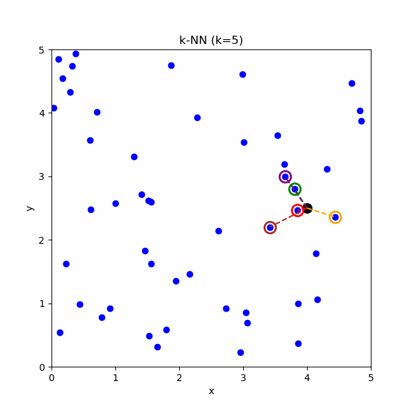

# k-Nearest Neighbors (k-NN) Regression

k-Nearest Neighbors (k-NN) Regression is a non-parametric, instance-based learning algorithm used to predict continuous outcomes. Instead of learning a fixed model, it makes predictions based on the local neighborhood of a query point.

## How k-NN Regression Works

1. **Distance Calculation:**  
   For a new query point, compute the distance (e.g., Euclidean distance) between this point and every point in the training dataset.

2. **Neighbor Selection:**  
   Identify the $k$ points in the training set that are closest to the query point.

3. **Aggregation (Averaging):**  
   The predicted value for the query is obtained by aggregating the target values of these $k$ nearest neighbors.

## Weighting the Neighbors

When taking the average of the neighbors' target values, you can choose between two main weighting schemes:

### 1. Uniform Weighting (Equal Weighting)

Each neighbor contributes equally to the prediction. If the target values of the $k$ neighbors are $y_1, y_2, \dots, y_k$, the prediction $\hat{y}$ is given by:

$$
\hat{y} = \frac{1}{k} \sum_{i=1}^{k} y_i
$$

### 2. Distance-Based Weighting

Closer neighbors are often more relevant than distant ones. In this approach, each neighbor is weighted inversely proportional to its distance from the query point. If $d_i$ is the distance of the $i$-th neighbor, a common weighting is:

$$
w_i = \frac{1}{d_i}
$$

The weighted prediction is computed as:

$$
\hat{y} = \frac{\sum_{i=1}^{k} w_i \, y_i}{\sum_{i=1}^{k} w_i}
$$

Alternative functions can be used (e.g., $\frac{1}{d_i^2}$ or a Gaussian kernel $w_i = \exp\left(-\frac{d_i^2}{2\sigma^2}\right)$).  
**Note:** If any $d_i$ is zero (i.e., the query point exactly matches a training point), you must handle this case appropriately—either by returning the corresponding target value directly or by adding a small constant to avoid division by zero.

## Graphical Example

Imagine a scatter plot where:

- The **x-axis** represents the feature.
- The **y-axis** represents the continuous target variable.

For a new query point (represented as `?`), the algorithm finds the $k$ nearest training points (blue dots) and averages their target values to produce a prediction for `?`.


- **Blue dots:** Training data points.
- **Black dot :** The point for which the prediction is being made.
- **Neighborhood:** The $k$ closest points used for computing the average target value, with colored circles indicating distance.

## Python Code Example

Below is a Python example using scikit-learn and matplotlib to demonstrate k-NN Regression on a synthetic dataset.

```python
import numpy as np
import matplotlib.pyplot as plt
from sklearn.neighbors import KNeighborsRegressor
from sklearn.model_selection import train_test_split
from sklearn.preprocessing import StandardScaler

# 1. Generate Synthetic Data
np.random.seed(42)
X = np.sort(5 * np.random.rand(100, 1), axis=0)  # 100 random points in [0, 5]
y = np.sin(X).ravel()                           # underlying sine function
y += 0.3 * np.random.randn(100)                 # add noise

# 2. Split the Data into Training and Test Sets
X_train, X_test, y_train, y_test = train_test_split(X, y, test_size=0.2, random_state=42)

# 3. Feature Scaling (important for distance-based algorithms)
scaler = StandardScaler()
X_train_scaled = scaler.fit_transform(X_train)
X_test_scaled = scaler.transform(X_test)

# 4. Create and Train the KNN Regressor
k = 5  # number of neighbors
# To use uniform weighting, set weights='uniform' (default).
# To use distance-based weighting, set weights='distance'.
knn_regressor = KNeighborsRegressor(n_neighbors=k, weights='distance')
knn_regressor.fit(X_train_scaled, y_train)

# 5. Create a Dense Grid for Predictions
X_grid = np.linspace(0, 5, 500).reshape(-1, 1)
X_grid_scaled = scaler.transform(X_grid)
y_pred = knn_regressor.predict(X_grid_scaled)

# 6. Plot the Results
plt.figure(figsize=(10, 6))
plt.scatter(X_train, y_train, color='blue', label='Training Data')
plt.scatter(X_test, y_test, color='green', label='Test Data')
plt.plot(X_grid, y_pred, color='red', label=f'KNN Regression (k={k})', linewidth=2)
plt.xlabel('Feature')
plt.ylabel('Target')
plt.title('k-Nearest Neighbors Regression')
plt.legend()
plt.show()
